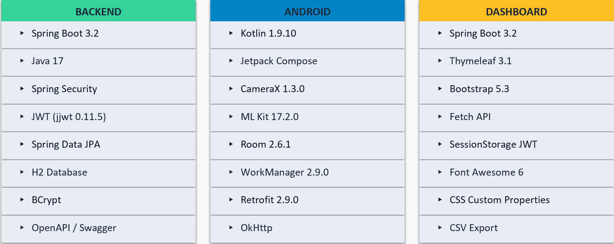

# Inventory Management System (InventoryApp)

A full-stack, offline-first inventory management system. Developed as a Diploma Project (2026).

## 🚀 Key Features
- **Offline-First:** Built with **Room & WorkManager**. Transactions queue locally and auto-sync when network returns—zero data loss.
- **Barcode Scanning:** Native Android integration via **CameraX & Google ML Kit**.
- **Secure:** Role-Based Access Control (`ADMIN`, `MANAGER`, `EMPLOYEE`) enforced via Spring Security & JWT.
- **Web Dashboard:** Responsive management interface using Thymeleaf & Bootstrap 5.

---

## 🛠️ Getting Started

### Prerequisites
- JDK 17
- Android Studio (for Android client)
- Maven (for Backend)

### 1. Backend Setup
1. Navigate to `/backend`.
2. Configure `src/main/resources/application.properties`:
   - Set `jwt.secret=your-secure-random-string-here`
   - Ensure H2 database path is set to a local directory.
3. Run: `mvn spring-boot:run`

### 2. Web Dashboard Setup
1. Navigate to `/web-dashboard`.
2. The dashboard runs on port 8081. Ensure the Backend is running on 8082 first.
3. Open `http://localhost:8081` in your browser.

### 3. Android App Setup
1. Open the `/android-app` folder in Android Studio.
2. In `ApiClient.kt`, ensure `BASE_URL` points to your backend (e.g., `http://10.0.2.2:8082/` for emulator).
3. Build and run on an Android 8.0+ device/emulator.

---

## 🏗️ Architecture

## 📊 Technical Stack

---
*Developed by Mircea-Andrei Rață (2026)*