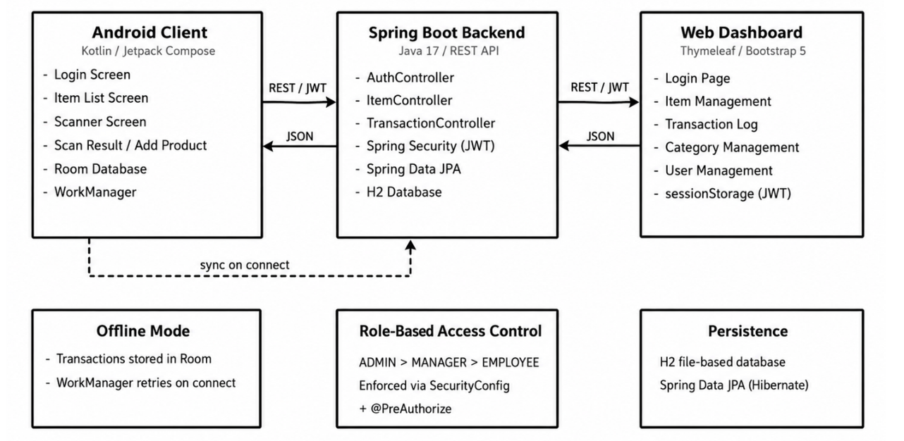
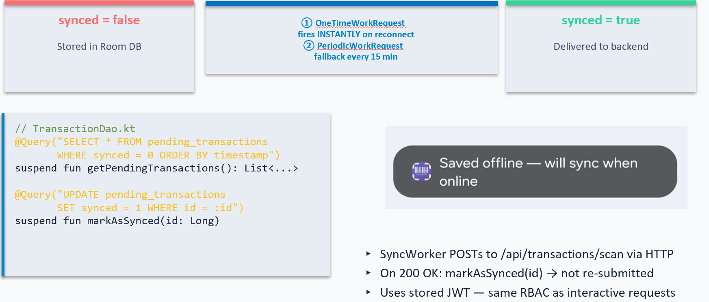
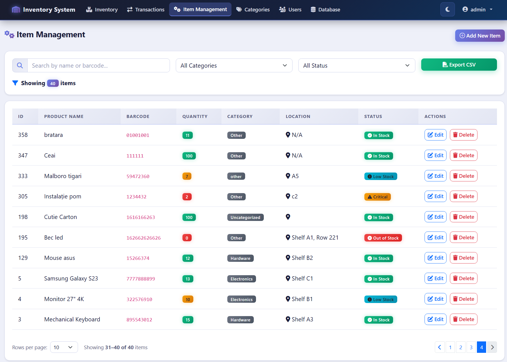

# 📦 Warehouse inventory platform

---

## 🎯 About

**Warehouse inventory platform** is a multi-platform inventory management system designed to simplify warehouse operations through barcode scanning, offline-first functionality, automatic synchronization, and role-based access control.

The system consists of:

* 📱 **Android App** — warehouse operations and barcode scanning
* ⚙️ **Spring Boot Backend** — REST API, business logic, security
* 🌐 **Web Dashboard** — inventory and administration

---

## 🏗️ Architecture

The system follows a decoupled **three-tier client-server architecture**:

```text
┌──────────────────┐
│   Android App    │
│ Kotlin + Compose │
└────────┬─────────┘
         │ REST API
         ▼
┌──────────────────┐
│ Spring Boot API  │
│ Java 17          │
└────────┬─────────┘
         │
         ▼
┌──────────────────┐
│   H2 Database    │
└──────────────────┘
         ▲
         │ REST API
┌────────┴─────────┐
│  Web Dashboard   │
│ Thymeleaf + BS5  │
└──────────────────┘
```



> **System Overview & Component Topology**

---

## ✨ Features

### 📷 Barcode Scanning

* EAN-13, EAN-8, UPC-A, and QR Codes
* On-device scanning using **CameraX** + **Google ML Kit**
* No internet connection required for barcode recognition

### 📴 Offline-First & Synchronization

Transactions are stored locally using **Room** when the device is offline and automatically synchronized using **WorkManager** when connectivity returns.

```text
Scan → Room → Pending → WorkManager → Backend → Synced
```



> **Transaction Synchronization State Machine & Room Inspector**

### 📦 Implicit Item Creation

Scanning an unknown barcode can automatically create the corresponding item and record the transaction through:

```http
POST /api/transactions/scan
```

This avoids interrupting the warehouse workflow by eliminating the need for a separate manual product creation step.

### 🔐 Security

* JWT authentication
* Spring Security
* BCrypt password hashing
* Method-level authorization via `@PreAuthorize`
* Role-Based Access Control (RBAC)

| Role         | Access                               |
| ------------ | ------------------------------------ |
| **EMPLOYEE** | Scanning and stock transactions      |
| **MANAGER**  | Inventory and transaction management |
| **ADMIN**    | Full system administration           |

### 🌐 Web Dashboard

The web interface provides managers and administrators with centralized monitoring and control:

* Inventory management and inline editing
* Transaction history and audit trails
* Dynamic table filtering and status views
* CSV export of filtered rows
* Dark mode with persistent theme preference
* Duplicate barcode detection
* User administration



> **Web Dashboard Interface & Item Management**

---

## 🛠️ Tech Stack & Components

* **Backend:** `Java 17` · `Spring Boot 3.2` · `Spring Security` · `JWT` · `JPA` · `Hibernate` · `H2` · `Maven`
* **Android:** `Kotlin` · `Jetpack Compose` · `CameraX` · `Google ML Kit` · `Retrofit` · `OkHttp` · `Room` · `WorkManager`
* **Web:** `Thymeleaf` · `Bootstrap 5.3` · `JavaScript` · `Fetch API`

---

## 🚀 Quick Start

### Backend

```bash
cd backend
mvn spring-boot:run
```

Runs on:

```text
http://localhost:8082
```

Configure the JWT secret in:

```text
src/main/resources/application.properties
```

Example:

```properties
jwt.secret=your-secure-random-string-here
```


### Web Dashboard

```bash
cd web-dashboard
mvn spring-boot:run
```

Open:

```text
http://localhost:8081
```

### Android

Open the `android-app` directory in **Android Studio**.

For the Android Emulator:

```kotlin
const val BASE_URL = "http://10.0.2.2:8082/"
```

For a physical device, replace the address with the local IP address of the computer running the backend.

The Android device and backend machine must be connected to the same network.

---

## 📁 Repository Structure

Ensure your `/images` folder contains the required project screenshots:

```text
InventoryApp/
├── backend/
├── android-app/
├── web-dashboard/
├── images/
│   ├── architecture.png
│   ├── offline-sync.png
│   ├── dashboard.png
│   └── tech-stack.png
└── README.md
```

---

## 🎓 Diploma Project

**2026 — National University of Science and Technology POLITEHNICA Bucharest**

**Author:** Mircea-Andrei Rață


---

## 📄 License

Academic diploma project developed for educational purposes.
